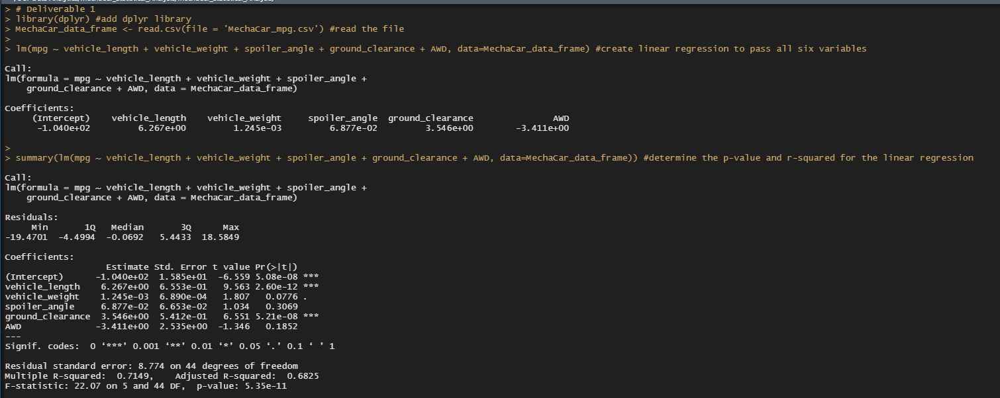
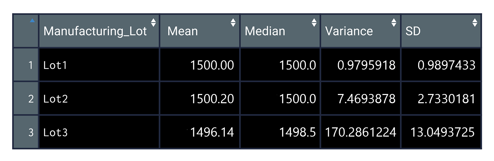
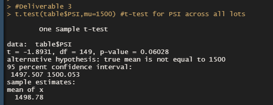
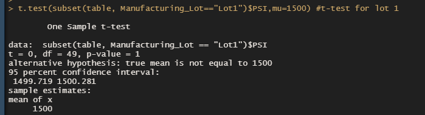
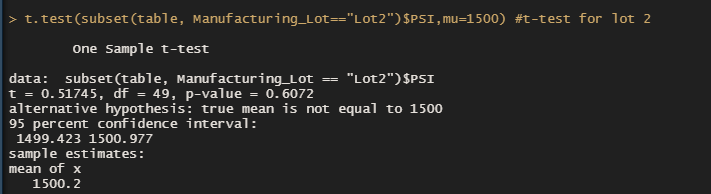
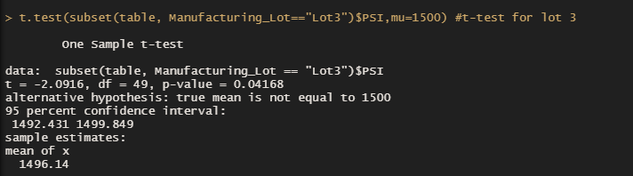
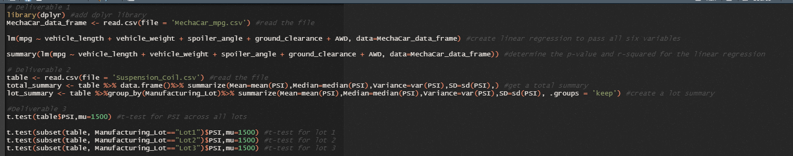

# MechaCar_Statistical_Analysis

# Overview & Background

A few weeks after starting his new role, Jeremy is approached by upper management about a special project. AutosRUs’ newest prototype, the MechaCar, is suffering from production troubles that are blocking the manufacturing team’s progress. AutosRUs’ upper management has called on Jeremy and the data analytics team to review the production data for insights that may help the manufacturing team.

In this challenge, you’ll help Jeremy and the data analytics team do the following:

Perform multiple linear regression analysis to identify which variables in the dataset predict the mpg of MechaCar prototypes
Collect summary statistics on the pounds per square inch (PSI) of the suspension coils from the manufacturing lots
Run t-tests to determine if the manufacturing lots are statistically different from the mean population
Design a statistical study to compare vehicle performance of the MechaCar vehicles against vehicles from other manufacturers. For each statistical analysis, you’ll write a summary interpretation of the findings.

The client is asking for a statistical analysis of MechaCar due to its production troubles which is blocking the manufacturing team's progress.

# Purpose

This new assignment consists of three technical analysis deliverables and a proposal for further statistical study. You’ll submit the following:

Deliverable 1: Linear Regression to Predict MPG
Deliverable 2: Summary Statistics on Suspension Coils
Deliverable 3: T-Test on Suspension Coils
Deliverable 4: Design a Study Comparing the MechaCar to the Competition

# Results 

# Deliverable 1: Linear Regression to Predict MPG

The MechaCar_mpg.csv dataset contains mpg test results for 50 prototype MechaCars. The MechaCar prototypes were produced using multiple design specifications to identify ideal vehicle performance. Multiple metrics, such as vehicle length, vehicle weight, spoiler angle, drivetrain, and ground clearance, were collected for each vehicle. Using your knowledge of R, you’ll design a linear model that predicts the mpg of MechaCar prototypes using several variables from the MechaCar_mpg.csv file. Then, you’ll write a short interpretation of the multiple linear regression results in the README.md.

To Deliver:

- The MechaCar_mpg.csv file is imported and read into a dataframe
- An RScript is written for a linear regression model to be performed on all six variables
- An RScript is written to create the statistical summary of the linear regression model with the intended p-values
- There is a summary that addresses all three questions

# Written Summary
## Linear Regression to Predict MPG
In your README, create a subheading, ## Linear Regression to Predict MPG, and write a short summary using a screenshot of the output from the linear regression, and address the following questions:

Which variables/coefficients provided a non-random amount of variance to the mpg values in the dataset?
Is the slope of the linear model considered to be zero? Why or why not?
Does this linear model predict mpg of MechaCar prototypes effectively? Why or why not?
## Linear Regression to Predict MPG

Results on Deliverable:
Resulting Model:

# Deliverable 2: Create Visualizations for the Trip Analysis 
The MechaCar Suspension_Coil.csv dataset contains the results from multiple production lots. In this dataset, the weight capacities of multiple suspension coils were tested to determine if the manufacturing process is consistent across production lots. Using your knowledge of R, you’ll create a summary statistics table to show:

The suspension coil’s PSI continuous variable across all manufacturing lots
The following PSI metrics for each lot: mean, median, variance, and standard deviation.
Then, in the README.md, you’ll briefly detail and interpret the suspension coil summary statistics.

Technical Analysis
Download the Suspension_Coil.csv file, and place it in the active directory for your R session.
In your MechaCarChallenge.RScript, import and read in the Suspension_Coil.csv file as a table.
Write an RScript that creates a total_summary dataframe using the summarize() function to get the mean, median, variance, and standard deviation of the suspension coil’s PSI column.

Your total_summary dataframe should look like this:

- Results on Deliverable:
- Resulting Model:

Write an RScript that creates a lot_summary dataframe using the group_by() and the summarize() functions to group each manufacturing lot by the mean, median, variance, and standard deviation of the suspension coil’s PSI column.
Your lot_summary dataframe should look like this:

# Written Summary
In your README, create a subheading ## Summary Statistics on Suspension Coils, and write a short summary using screenshots from your total_summary and lot_summary dataframes, and address the following question:

The design specifications for the MechaCar suspension coils dictate that the variance of the suspension coils must not exceed 100 pounds per square inch. Does the current manufacturing data meet this design specification for all manufacturing lots in total and each lot individually? Why or why not?
## Summary Statistics on Suspension Coils

# Deliverable 3: T-Tests on Suspension Coils
Using your knowledge of R, perform t-tests to determine if all manufacturing lots and each lot individually are statistically different from the population mean of 1,500 pounds per square inch.

Follow the instructions below to complete Deliverable 3.

Technical Analysis
In your MechaCarChallenge.RScript, write an RScript using the t.test() function to determine if the PSI across all manufacturing lots is statistically different from the population mean of 1,500 pounds per square inch.
Next, write three more RScripts in your MechaCarChallenge.RScript using the t.test() function and its subset() argument to determine if the PSI for each manufacturing lot is statistically different from the population mean of 1,500 pounds per square inch.

- Results on Deliverable:
- Resulting Model:

# Written Summary
In your README, create a subheading ## T-Tests on Suspension Coils, then briefly summarize your interpretation and findings for the t-test results. Include screenshots of the t-test to support your summary.
## T-Tests on Suspension Coils

We can see that there is not enough evidence to reject the null hypothesis. The two means are statistically similar; therefore, suspension coils across all lots are very close to the PSI of the population. It also shows the p-value of 0.06028, which is greater than 0.05; thus, the data is considered a normal distribution.

We can see that there is not enough evidence to reject the null hypothesis. The two means are statistically similar; therefore, Lot 1 suspension coils are very close to the PSI of the population. Image 5 also shows the p-value of 1, which is more significant than 0.05; thus, the data is considered a normal distribution.

We can see that there is not enough evidence to reject the null hypothesis. The two means are statistically similar; therefore, Lot 2 suspension coils are very close to the PSI of the population. Image 6 also shows the p-value of .6072, which is greater than 0.05; thus, the data is considered a normal distribution.

We can see that there is sufficient statistical evidence that the null hypothesis is not true; therefore, the null hypothesis is rejected. There is a statistical difference between the Lot 3 suspension coils and the PSI of the population. Image 7 also shows the p-value of .04168, which is less than 0.05; thus, the data is considered a skewed distribution.

# Deliverable 4: Design a Study Comparing the MechaCar to the Competition

Using your knowledge of R, design a statistical study to compare performance of the MechaCar vehicles against performance of vehicles from other manufacturers.

Follow the instructions below to complete Deliverable 4.

In your README, create a subheading ## Study Design: MechaCar vs Competition.
Write a short description of a statistical study that can quantify how the MechaCar performs against the competition. In your study design, think critically about what metrics would be of interest to a consumer: for a few examples, cost, city or highway fuel efficiency, horse power, maintenance cost, or safety rating.

## Study Design: MechaCar vs Competition

I think that the fuel efficiency of the MechaCar is better than the competition.  The MechaCar gets about 100 miles per gallon.  That is over twice as much as the average car.
What metric or metrics are you going to test? I am going to test the fuel efficiency of the MechaCar. I will use the miles per gallon that the car gets. To answer the question of What is the null hypothesis or alternative hypothesis? The null hypothesis is that the MechaCar does not have a better fuel efficiency than the competition. The alternative hypothesis is that the MechaCar does have a better fuel efficiency than the competition. To be able to answer, What statistical test would you use to test the hypothesis? And why? I would use the z-test. I would use the z-test because it is an excellent test to use when you have limited information. To be able to address What data is needed to run the statistical test? I would need the fuel efficiency of the MechaCar and the fuel efficiency of the competition.

# Summary

In Deliverable 1: I was able to create Linear Regression to Predict MPG in the Deliverable 2: Summary Statistics on Suspension Coils in Deliverable 3: T-Test on Suspension Coils
and in the Deliverable 4: Design a Study Comparing the MechaCar to the Competition. 

In this module I was able to learn the followig topics in R Script.

- Load, clean up, and reshape datasets using tidyverse in R.
- Visualize datasets with basic plots such as line, bar, and scatter plots using ggplot2.
- Generate and interpret more complex plots such as boxplots and heatmaps using ggplot2.
- Plot and identify distribution characteristics of a given dataset.
- Formulate null and alternative hypothesis tests for a given data problem.
- Implement and evaluate simple linear regression and multiple linear regression models for a given dataset.
- Implement and evaluate the one-sample t-Tests, two-sample t-Tests, and analysis of variance (ANOVA) models for a given dataset.
- Implement and evaluate a chi-squared test for a given dataset.
- Identify key characteristics of A/B and A/A testing.
- Determine the most appropriate statistical test for a given hypothesis and dataset.

